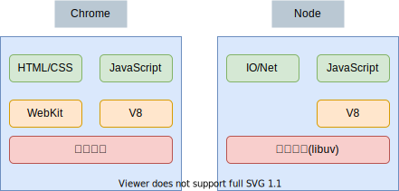

# Node简介与安装

## 一 Node 简介

Node.js 由 Ryan Dahl 于 2009 年发布，其最初的目的是为了基于高性能的 V8 引擎开发一个高性能 Web 服务器（类似 Apache/Tomcat 的软件），由于 Node 补充了 JavaScript 在 Web 服务端的空白，其自带的网络、文件能力也让 Node 在前端工程化工具领域大放异彩，Node 收获了意想不到的繁荣。

我们之前在学习 JavaScript 的时候，都是基于浏览器而学习的。切记：EcmaScript 只是 JS 语言的标准，为编程语言提供语法准则，并未提供 API，类似`document`、`window`、`getElementById()`这些对象、函数不是 JavaScript 本身的能力，而是浏览器封装给我们使用的。这种额外封装了编程语言执行环境的进程级系统，我们称之为运行时。目前 JavaScript 常见的运行时环境：

- 浏览器：封装了 DOM、BOM 等页面渲染相关的 API，JS 依赖于此可以操作浏览器上的元素等。其中 Chrome 浏览器底层解析 JS 的引擎是 V8。
- Node：封装了文件、网络的 API，JS 依赖于此可以操作计算机中的文件、网络等。与 Chrome 浏览器相同，起解析 JS 的引擎也是 V8。  

Node 的出现很大程度上依赖于 V8 引擎，Chrome 浏览器内部解释引擎也是 V8，他们的共同点是都遵循 ECMAScript 的标准 ，下图是 Chrome 浏览器与 Node.js 的内核区别：



综上所述，Node 的官网对 Node 的概述非常准确：
> Node.js® is a JavaScript runtime built on Chrome's V8 JavaScript engine.
> Node.js 是一个基于 Chrome 的  0i·1  V8 JavaScript 引擎 构建的 JavaScript 运行时。

当然，Node 的周边生态已经相当繁荣，类似 Java 平台，我们也可以将 Node 理解为一个开发平台：

```html
开发平台：    Node            Java
编程语言：    JavaScript      Java
解析引擎：    V8              JVM
包管理器：    NPM             Maven  
```

## 二 Node 架构

Node 的核心部分有两部分：

- V8 引擎：由 C++ 语言开发的编译器，提供解析 JavaScript 语言的能力。该引擎由 Google 公司推出，是 Chrome 浏览器内置的 JavaScript 引擎
- libuv：由 C++ 语言开发的异步 I/O 库，在该库基础上，Node 提供了网络、文件等操作系统 API。该库由 Node 作者 Ryan Dahl 自己为了 Node 拥有异步 I/O 能力亲自开发。


Node 内部维护着一个核心线程专门用于处理各种网络请求，对请求对应的事件进行异步分发。binging 一层是 JS 与底层 C++沟通的关键，前者通过 bindings 调用后者，相互交换数据，libuv 为 Node 提供了跨平台、线程池、事件池、异步 IO 能力。

## 三 Node 特点

> **非阻塞 I/O**：Node 大量的异步 API 为开发者提供了友好的 非阻塞 I/O 编程环境

I/O 操作往往是 Web 领域最有代表性的性能瓶颈之地。在传统开发平台中，发起一个 I/O 操作后，线程会暂停下来，等待 I/O 结束后才能继续执行后续代码，即：I/O 阻塞了代码的执行，这回极大地降低程序的执行效率。Node 在设计之初就引入了大量的异步 API，如 Node 在执行了访问数据库的代码之后，将立即转而执行其后面的代码，把数据库返回结果的处理代码放在回调函数中，从而提高了程序的执行效率，如下所示：

```js
var fs = require("fs");

fs.readFile("/path", function (err, file) {
  console.log("befroe...");
});
console.log("after....");
```

输出结果如下：

```html
after...
before...
```

> **单线程（非严格意义）**：Node 利用事件循环机制，在单线程上处理业务代码，避免了传统语言反复切换线程上下文带来的损耗。

Node 本身内部其实是有很多线程的，但与其他开发平台最大的不同是：在核心业务处理上，只有一个线程，且只用于监听事件的流动。在其他大多编程语言中，如 Java、Python，每有一个客户端接入服务器，服务端都会创建一个新的线程用来处理该连接，每个线程需要海飞大约 2MB 内存，理论上，一台 8G 内存服务器同时只能有 4000 个客户端连接。而 Node 中，负责客户端连接处理的线程只有一个，该线程并不会真正处理连接业务，而是通过非阻塞 I/O 直接将连接处理交给操作系统处理，自己继续接收下一个连接请求。

## 四 Node 的问题

虽然单线程非阻塞 I/O 的设计给 Node 应用程序开发提供了极大的性能支持，但是也造成了 2 个极端情况：

- 异步编程体验极其糟糕，不过该危机在 ES7 标准出现后（对应 Node 的 7.6 版本）已经大幅减小
- 单线程带来的阻塞问题：Node 的核心线程一直在循环处理各种事件，该线程一旦要去处理一个耗时操作，就会造成整个 Node 服务暂停，这是不可原谅的，比如在 Node 服务中，计算一个效率不高的位运算，那么整个事件循环会因为该运算而停止。该问题在 Node10 版本得到缓解，该版本提供了开启工作线程的 api，即将耗时操作交给新开启的工作线程处理。

## 五 Node 应用领域

根据 Node 的特点，可以看出 Node 适合 I/O 密集型场景，不适合 CPU 密集型场景，当然 Node10 版本后（worker_threads）该问题也得到了缓解。Node 目前的主要应用领域：

- Web 开发：与 JavaWeb、PyhtonWeb 相同，可以应用于 Web 开发，因为 Web 是最常见的网络 I/O 场景
- 命令行工具：目前市面上已经拥有大量的替代 shell 的 Node 开发的命令行工具，最出名的是前端开发领域的构建工具 Webpack
- 客户端开发：使用基于 Node 的框架 Electron 可以快速开发跨平台客户端

## 六 Node 安装

### 6.0 安装说明

Node 只需要在官网下载对应安装包下一步下一步安装即可，**默认会配置环境变量**。下载界面有两个版本：长期支持版(LTS)、Current(最新版)，建议使用LTS版本，当然 Node 的版本号中偶数位版本一般为稳定版，奇数位版本一般为非稳定版。

但是由于 Node 迭代速度很快，在企业开发中，经常要在多个 Node 版本中切换，使用 Node 的版本管理工具 nvm 来安装 Node，这样可以方便我们控制 Node 的版本。

> 贴士：nvm 安装也可以有效避免直接安装可能会出现的权限问题，笔者极力推荐使用 nvm 安装 Node。

### 6.1 安装 nvm

**Win 安装 nvm**：Win上是没有 nvm 的，但是有开发者提供了类似 nvm 的工具，下载地址为：<https://github.com/coreybutler/nvm-windows/releases>

```html
# 安装方式：下载 nvm-setup.zip 直接下一步下一步安装即可

# 安装完毕后查看是否安装成功
nvm version
```

**Linux 与 Mac** 安装：下载地址为 <https://github.com/creationix/nvm>

```html
# 安装方式
curl -o- https://raw.githubusercontent.com/nvm-sh/nvm/v0.34.0/install.sh | bash

# 配置环境变量
vim ~/.bash_profile
export NVM_DIR="${XDG_CONFIG_HOME/:-$HOME/.}nvm"
[ -s "$NVM_DIR/nvm.sh" ] && \. "$NVM_DIR/nvm.sh" # This loads nvm
source ~/.bash_profile

# 安装后查看：
nvm version
```

注意：新版 Mac 系统默认使用 zsh 作为命令行工具，需要进行调整：

```html
vim ~/.zshrc
setopt no_nomatch
export NVM_DIR="${XDG_CONFIG_HOME/:-$HOME/.}nvm"
[ -s "$NVM_DIR/nvm.sh" ] && \. "$NVM_DIR/nvm.sh" # This loads nvm
source ~/.zshrc

# 安装后查看：
nvm version
```

### 6.2 使用 nvm 安装 node

使用步骤:

```html
# 可以先配置镜像地址
nvm node_mirror https://npm.taobao.org/mirrors/node/    # node镜像地址
nvm npm_mirror https://npm.taobao.org/mirrors/npm/      # node包镜像地址

# 安装最新版
nvm install latest
# 安装指定版本
nvm install 8.11.3
# 切换版本
nvm use 8.11.3
# 指定默认版本
nvm alias default 8.5.0

# 查看是否安装成功
node -v
```
