## 一 Node 概述

### 1.1 Node 简介

Node.js 由 Ryan Dahl 于 2009 年发布，RY 原本的目的是为了开发高性能 web 服务器，由于基于异步事件驱动的想法与 js 本身的异步特性相像，且 JS 在 web 服务端领域一片空白，Node.js 横空出世。

Node.js 是 javascript 运行时环境，目前 JS 常见的运行时环境有两个：

- Node.js：封装了操作网络、文件的 api
- 浏览器：封装了操作 DOM 和 BOM 的 api

### 1.2 Node 架构

Node 的出现很大程度上依赖于 V8 引擎，Chrome 浏览器内部解释引擎也是 V8，他们的共同点是都遵循 ECMAScript 的标准 ，下图是 Chrome 浏览器与 Node.js 的内核区别：



Node 本身又是如何工作的呢？Node 内部有两个最重要的组件：

- V8：对 JavaScript 有极高的解释性能
- libuv：C++开发的高性能异步 I/O 库


Node 内部维护着一个核心线程专门用于处理各种网络请求，对请求对应的事件进行异步分发。binging 一层是 JS 与底层 C++沟通的关键，前者通过 bindings 调用后者，相互交换数据，libuv 为 Node 提供了跨平台、线程池、事件池、异步 IO 能力。

### 1.3 Node 特点

**非阻塞 I/O**：

Web 服务在很多场景中，最影响性能的就是 I/O 操作，在传统的开发语言中，发起一个 I/O 操作后，线程会暂停下来，需要等待 I/O 结束后才能继续运行，也就是说，I/O 阻塞了代码的执行，极大地降低了程序的执行效率。Node 在设计之初就引入了大量的异步 API，来减少同步操作，比如 Node 在执行了访问数据库的代码之后，将立即转而执行其后面的代码，把数据库返回结果的处理代码放在回调函数中，从而提高了程序的执行效率。

Node 异步 I/O 示例：

```js
var fs = require("fs");

fs.readFile("/path", function (err, file) {
  console.log("我在前面，后输出");
});
console.log("我在后面，先输出");
```

**单线程(非严格意义)**：  
非严格意义上是说 Node 本身内部其实是有很多线程的，但是在核心业务处理上，只有一个线程，用于监听事件的流动。在其他大多编程语言中，如 Java、Python，每有一个客户端接入服务器，服务端都会创建一个新的线程用来处理该连接，每个线程需要海飞大约 2MB 内存，理论上，一台 8G 内存服务器同时只能有 4000 个客户端连接。而 Node 中，负责客户端连接处理的线程只有一个，该线程并不会真正处理连接业务，而是通过非阻塞 I/O 直接将连接处理交给操作系统处理，自己继续接收下一个连接请求。

**事件驱动**：

在 Node 中，客户端请求建立连接，提交数据等行为，会触发相应的事件。同一时刻，只能执行一个事件回调函数，但是在执行一个事件回调函数的中途，可以转而处理其他事件（比如，又有新用户连接了），然后返回继续执行原事件的回调函数，这种处理机制，称为“事件环”机制。这个事件机制依赖于底层的 libuv 库。事件的编程方式只用关注事件，在多个异步任务场景中，事件与事件之间相互独立，但是也带来了协作问题，这就是 node 著名的回调地狱。

### 1.4 Node 的问题

虽然单线程非阻塞 I/O 的设计给 Node 应用程序开发提供了极大的性能支持，但是也造成了 2 个极端情况：

- 异步编程体验极其糟糕，不过该危机在 ES7 标准出现后（对应 Node 的 7.6 版本）已经大幅减小
- 单线程带来的阻塞问题：我们知道 Node 中的核心线程一直在循环处理各种事件，该线程一旦要去处理一个耗时操作，就会造成整个 Node 服务暂停，这是不可原谅的，比如在 Node 服务中，计算一个效率不高的位运算，那么整个事件循环会因为该运算而停止。该问题在 Node10 版本得到缓解，该版本提供了开启工作线程的 api，即这种耗时操作交给新开启的工作线程处理。

### 1.5 Node 应用领域

根据 Node 的特点，我们可以看出 Node 适合 I/O 密集型场景，不适合 CPU 密集型场景（如刚才所说的计算一个效率不高的位运算），当然 Node10 版本后（worker_threads）该问题也得到了缓解。

Node 目前的主要应用领域：

- Web 开发：与 JavaWeb、PyhtonWeb 相同，可以应用于 Web 开发，因为 Web 是最常见的网络 I/O 场景
- 命令行工具：目前市面上已经拥有大量的替代 shell 的 Node 开发的命令行工具，最出名的是前端开发领域的 Webpack

## 二 Node 安装

### 2.0 安装说明

Node 只需要在官网下载对应安装包下一步下一步安装即可，默认会配置环境变量。其安装包的偶数位版本为稳定版，奇数位版本为非稳定版。

但是由于 Node 迭代速度很快，在企业开发中，经常要在多个 Node 版本中切换，nvm 是一款可以管理 node 版本的工具，使用 nvm 来安装 node，可以方便我们控制 node 的版本。

贴士：nvm 安装也可以有效避免直接安装可能会出现的权限问题，笔者极力推荐使用 nvm 安装 Node。

### 2.1 安装 nvm

win 安装 nvm：

```
# 下载地址：https://github.com/coreybutler/nvm-windows/releases

# 直接下一步下一步安装即可

# 安装完毕后查看是否安装成功
nvm version
```

Linux 与 Mac 安装：

```
# 仓库地址：https://github.com/creationix/nvm

# 执行安装：
curl -o- https://raw.githubusercontent.com/nvm-sh/nvm/v0.34.0/install.sh | bash

# 配置环境变量
vim ~/.bash_profile
export NVM_DIR="${XDG_CONFIG_HOME/:-$HOME/.}nvm"
[ -s "$NVM_DIR/nvm.sh" ] && \. "$NVM_DIR/nvm.sh" # This loads nvm
source ~/.bash_profile

# 安装后查看：
nvm version
```

注意：新版 Mac 系统默认使用 zsh 作为命令行工具，需要进行调整：

```
vim ~/.zshrc
setopt no_nomatch
export NVM_DIR="${XDG_CONFIG_HOME/:-$HOME/.}nvm"
[ -s "$NVM_DIR/nvm.sh" ] && \. "$NVM_DIR/nvm.sh" # This loads nvm
source ~/.zshrc

# 安装后查看：
nvm version
```

### 2.2 使用 nvm 安装 node

设置 nvm 下载镜像：

```
# 设置node下载镜像地址
nvm node_mirror https://npm.taobao.org/mirrors/node/

# 设置node的第三方包下载镜像地址
nvm npm_mirror https://npm.taobao.org/mirrors/npm/
```

安装 Node：

```
# 安装最新版
nvm install latest
# 安装指定版本
nvm install 8.11.3
# 切换版本
nvm use 8.11.3
# 指定默认版本
nvm alias default 8.5.0
```

安装完 node 后，可以使用 `node -v` 查看 node 版本。

## 三 开发工具

笔者推荐的 NodeJS 开发工具是 VScode/WebStorm。

如果是使用 VSCode 开发，推荐安装插件：

- Code Runner：用于运行 node 代码
- Search node_modules：用于 node 包快速提示

如果使用 WebStorme（或者 IDEA+Node 插件），则可能需要配置下 node 环境。打开 WebStorme，在设置中界面中选择：`File-setting-Languages&Frameworks-Node`，对比下图进行勾选：  

