## 一 Node概述

###  1.1 Node简介

Node.js由 Ryan Dahl 于2009年发布，RY原本的目的是为了开发高性能web服务器，由于基于异步事件驱动的想法与js本身的异步特性相像，且JS在web服务端领域一片空白，Node.js横空出世。  

Node.js是javascript运行时环境，目前JS常见的运行时环境有两个： 
- Node.js：封装了操作网络、文件的api
- 浏览器：封装了操作DOM和BOM的api

###  1.2 Node架构

Node的出现很大程度上依赖于V8引擎，Chrome浏览器内部解释引擎也是V8，他们的共同点是都遵循ECMAScript的标准 ，下图是Chrome浏览器与Node.js的内核区别：   

   

Node本身又是如何工作的呢？Node内部有两个最重要的组件：
- V8：对JavaScript有极高的解释性能
- libuv：C++开发的高性能异步I/O库

  

Node内部维护着一个核心线程专门用于处理各种网络请求，对请求对应的事件进行异步分发。binging一层是JS与底层C++沟通的关键，前者通过bindings调用后者，相互交换数据，libuv为Node提供了跨平台、线程池、事件池、异步IO能力。 

###  1.3 Node特点

**非阻塞I/O**：  

Web服务在很多场景中，最影响性能的就是I/O操作，在传统的开发语言中，发起一个I/O操作后，线程会暂停下来，需要等待I/O结束后才能继续运行，也就是说，I/O阻塞了代码的执行，极大地降低了程序的执行效率。Node在设计之初就引入了大量的异步API，来减少同步操作，比如Node在执行了访问数据库的代码之后，将立即转而执行其后面的代码，把数据库返回结果的处理代码放在回调函数中，从而提高了程序的执行效率。  

Node异步I/O示例：
```js
var fs = require('fs');

fs.readFile("/path", function(err, file){
    console.log("我在前面，后输出");
});
console.log("我在后面，先输出");
```

**单线程(非严格意义)**：  
非严格意义上是说Node本身内部其实是有很多线程的，但是在核心业务处理上，只有一个线程，用于监听事件的流动。在其他大多编程语言中，如Java、Python，每有一个客户端接入服务器，服务端都会创建一个新的线程用来处理该连接，每个线程需要海飞大约2MB内存，理论上，一台8G内存服务器同时只能有4000个客户端连接。而Node中，负责客户端连接处理的线程只有一个，该线程并不会真正处理连接业务，而是通过非阻塞I/O直接将连接处理交给操作系统处理，自己继续接收下一个连接请求。   

**事件驱动**：  

在Node中，客户端请求建立连接，提交数据等行为，会触发相应的事件。同一时刻，只能执行一个事件回调函数，但是在执行一个事件回调函数的中途，可以转而处理其他事件（比如，又有新用户连接了），然后返回继续执行原事件的回调函数，这种处理机制，称为“事件环”机制。这个事件机制依赖于底层的libuv库。事件的编程方式只用关注事件，在多个异步任务场景中，事件与事件之间相互独立，但是也带来了协作问题，这就是node著名的回调地狱。  

###  1.4 Node的问题

虽然单线程非阻塞I/O的设计给Node应用程序开发提供了极大的性能支持，但是也造成了2个极端情况：
- 异步编程体验极其糟糕，不过该危机在ES7标准出现后（对应Node的7.6版本）已经大幅减小
- 单线程带来的阻塞问题：我们知道Node中的核心线程一直在循环处理各种事件，该线程一旦要去处理一个耗时操作，就会造成整个Node服务暂停，这是不可原谅的，比如在Node服务中，计算一个效率不高的位运算，那么整个事件循环会因为该运算而停止。该问题在Node10版本得到缓解，该版本提供了开启工作线程的api，即这种耗时操作交给新开启的工作线程处理。

###  1.5 Node应用领域

根据Node的特点，我们可以看出Node适合I/O密集型场景，不适合CPU密集型场景（如刚才所说的计算一个效率不高的位运算），当然Node10版本后（worker_threads）该问题也得到了缓解。  

Node目前的主要应用领域：
- Web开发：与JavaWeb、PyhtonWeb相同，可以应用于Web开发，因为Web是最常见的网络I/O场景
- 命令行工具：目前市面上已经拥有大量的替代shell的Node开发的命令行工具，最出名的是前端开发领域的Webpack

## 二 Node安装

###  2.0 安装说明

Node只需要在官网下载对应安装包下一步下一步安装即可，默认会配置环境变量。其安装包的偶数位版本为稳定版，奇数位版本为非稳定版。  

但是由于Node迭代速度很快，在企业开发中，经常要在多个Node版本中切换，nvm是一款可以管理node版本的工具，使用nvm来安装node，可以方便我们控制node的版本。  

贴士：nvm安装也可以有效避免直接安装可能会出现的权限问题，笔者极力推荐使用nvm安装Node。

###  2.1 安装nvm

win安装nvm：
```
# 下载地址：https://github.com/coreybutler/nvm-windows/releases 

# 直接下一步下一步安装即可

# 安装完毕后查看是否安装成功
nvm version
```

Linux与Mac安装：
```
# 仓库地址：https://github.com/creationix/nvm  

# 执行安装：
curl -o- https://raw.githubusercontent.com/nvm-sh/nvm/v0.34.0/install.sh | bash

# 配置环境变量，注意Mac高版本使用zsh，需要修改的是 .zprofile
vim ~/.bash_profile
export NVM_DIR="${XDG_CONFIG_HOME/:-$HOME/.}nvm"
[ -s "$NVM_DIR/nvm.sh" ] && \. "$NVM_DIR/nvm.sh" # This loads nvm
source ~/.bash_profile

# 安装后查看：
nvm version
```

###  2.2 使用nvm安装node

设置nvm下载镜像：
```
# 设置node下载镜像地址
nvm node_mirror https://npm.taobao.org/mirrors/node/  

# 设置node的第三方包下载镜像地址
nvm npm_mirror https://npm.taobao.org/mirrors/npm/         
```

安装Node：
```
# 安装最新版
nvm install latest
# 安装指定版本
nvm install 8.11.3
# 切换版本
nvm use 8.11.3
# 查看当前使用版本
nvm use ls
# 指定默认版本
nvm alias default 8.5.0
```

安装完node后，可以使用 `node -v` 查看node版本。    

## 三 开发工具

笔者推荐的NodeJS开发工具是VScode/WebStorm。  

如果是使用VSCode开发，推荐安装插件：
- Code Runner：用于运行node代码
- Search node_modules：用于node包快速提示

如果使用WebStorme（或者IDEA+Node插件），则可能需要配置下node环境。打开WebStorme，在设置中界面中选择：`File-setting-Languages&Frameworks-Node`，对比下图进行勾选：  
