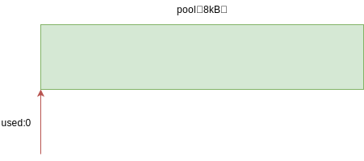
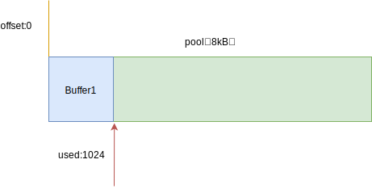

## 一 Buffer内的内存分配

###  1.0 Buffer内存分配概念

Buffer的内存申请并不是靠V8，而是C++层面原生实现的，采用了slab分配机制（一种动态内存管理机制）。该机制简单来说，就是一块申请好的固定大小的内存区域，具有如下状态：
- full：完全分配状态
- partial：部分分配状态
- empty：没有被分配状态

Node以8KB位接线区分Buffer是大对象还是小对象,这个8KB就是每个slab的大小，Node以其为基础单元进行内存分配。

###  1.1 分配小Buffer对象

在`new Buffer(1024)`时，此时构造对象小于8KB，Node会检查一个对象pool有没有创建，没有则会创建。创建后，处于分配状态的slab单元都会指向它：

  

在上图中，这个slab处于empty状态

```js
var pool;
if (!pool || pool.length - pool.used < this.length) alloclPool();

function allocPool(){                           // 申请内存函数
    pool = new SlowBuffer(Buffer.poolSize);     // 将新申请的SlowBuffer对象指向pool
    pool.used = 0;
}
```

构造完pool后，当前Buffer对象的parent属性也会指向该slab，并记录下从这个slab的哪个位置开始开始使用，slab对象自身也会记录被使用了多少字节： 
```js
    this.parent = pool;
    this.offset = pool.used;
    pool.used += this.length;
    if (pool.used & 7) pool.used = (pool.used + 8) & ~ 7
```

  

此时slab状态为partial，如果这时候再次创建一个Buffer，构造中会检查这个slab的剩余空间是否足够，如果足够，则使用剩余空间，并更新slab分配情况。如下所示，再次`new Buffer(3000)` ：  

   

如果slab剩余空间不够，则会构造新的slab。   

某些情况下会造成slab剩余空间的浪费，第一次构造1字节Buffer，第二次构造8192字节Buffer，第二次分配时slab剩余空间不够，就会创建新的slab，则刚才的slab将会被一个1字节的Buffer对象独占，也就会造成一个极端情况：这个1字节的Buffer一直没有释放，相应的这8KB也一直没有释放。  

###  1.2 分配大Buffer对象

超过8KB的大Buffer对象，将会直接分配一个SlowBuffer对象作为slab单元，这个slab单元会被这个大Buffer对象独占：
```js
// Big buffer, just alloc one
this.parent = new SlowBuffer(this.length);          // SlowBuffer是C++模块
this.offset = 0;
```

## 二 Buffer的应用

由于Buffer能在有效对数据进行拆分传输，在文件I/O，网络I/O中占据很大使用场合。网络传输中的字符串一般都会转换为Buffer，以二进制方式进行传输，这种转换在网络中的饿请求响应中几乎时时刻刻在发生。  

如果预先将普通的内容转换为Buffer对象，就可以有效减少服务器资源浪费。实践中的案例如动静分离，静态内容往往会先转换为Buffer格式，这样浏览器在访问网页内容时，服务器就无需转换再传输了！  