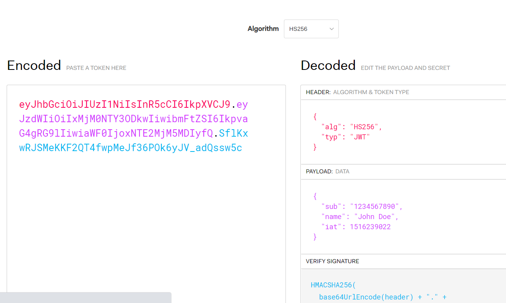
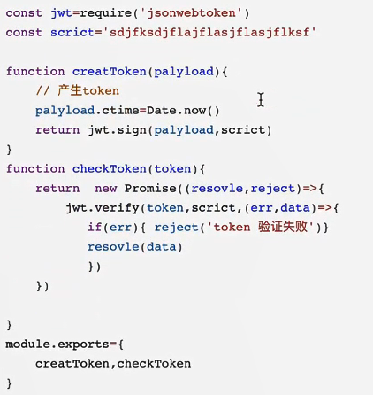
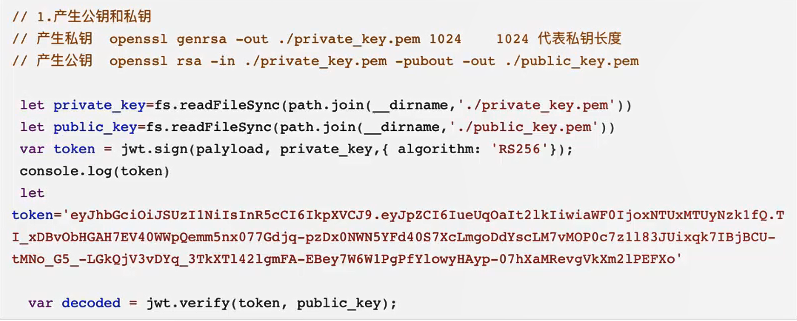

# JWT 鉴权

TODO

## 一 JWT 简介

JWT (Json Web Token) 是目前非常流行的鉴权方案。官网地址为：<https://jwt.io/>

在官网中，可以看到 JWT 加密解密的结果如下所示：  

  

解析上图：

- Token：即左侧区域内容，是按照指定的算法（图中是hash256）生成的字符串。字符串的颜色分别对应右侧解密后的部分。
- Header：放置 JWT 的一些基本信息
- Payload：称为载荷，也即数据，是真实的状态信息，如账户、密码、sessionID
- Verify Signature：加密方式，即将 Header、Payload、私钥三部分加密

## 二 JWT 的使用

### 2.0 JWT 鉴权的流程

```html
1 用户登录，此时服务端产生 JWT 的 Token，并将该 Token 返回
2 前端接收到 Token 后，保存该 Token（存储于Cookie、localStorage均可）
3 后续每次请求，携带该 Token （请求头、Cookie中均可携带）
4 服务端每次收到请求，解密 Token，验证 Token 是否合法（其实是验证Token中的账号密码/SID是否合法）
```

JWT 的鉴权方式，非常适用于 无状态请求、第三方登录等场景。

### 2.1 Token 的创建

Token 的创建可以依据需求，使用非对称加密、对称加密均可。  

对称方式：
  

参数 payload 为一个对象：

```js
let payload = {
    usrename: abc,
    password: 134
}
```

非对称加密方式（利用私钥产生Token）：
  
